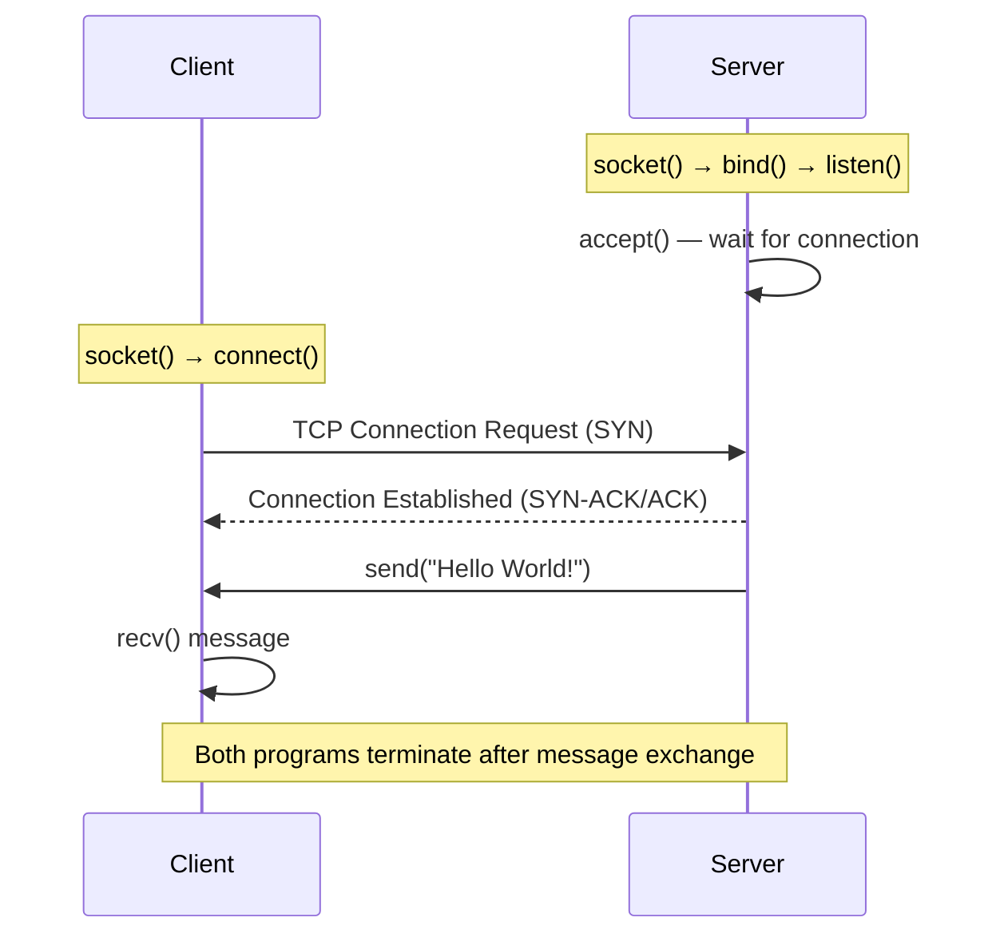

# 🔌 Network Programming Labs

### Low-Level Systems & Socket Programming in C · SDN Fundamentals


> Hands-on networking and systems programming labs developed in **C** on **Linux** environments, focused on **TCP/IP communication**, **socket programming**, and **client-server architectures** — extending into **Software-Defined Networking (SDN)** concepts using Mininet.

This repository contains low-level network programming exercises and SDN topology labs commonly encountered in **infrastructure**, **cloud**, and **cybersecurity** environments.

---

## 📑 Table of Contents

| Section |
|---|
| [Overview](#-overview) |
| [Communication Model](#-communication-model) |
| [Projects Included](#-projects-included) |
| [Topics Covered](#-topics-covered) |
| [Technologies Used](#️-technologies-used) |
| [Skills Developed](#-skills-developed) |
| [Compilation & Execution](#-compilation--execution) |
| [Repository Structure](#-repository-structure) |

---

## 🚀 Overview

| Field | Details |
|---|---|
| **Languages** | C, Mininet CLI / Python-based topologies |
| **Platform** | Linux, VirtualBox (VM) |
| **Compiler** | GCC |
| **API** | BSD Sockets (POSIX) |
| **Protocol Focus** | TCP/IP, IPv4, ICMP (ping) |
| **Architecture** | Client-Server · Software-Defined Networking |
| **Context** | University coursework — Network & Systems Programming |
| **Goal** | Understand network communication from manual socket handling in C to SDN topology orchestration in virtualized environments |

---

## 🔄 Communication Model



*Μοντέλο επικοινωνίας του EchoServer/EchoClient (Project 3, Μέρος Α): σύνδεση, αποστολή μηνύματος από τον server, άμεσος τερματισμός.*

---

## 📦 Projects Included

| # | Project | Type | Description |
|---|---|---|---|
| 1 | `Project 1` | TCP Client-Server | Βασική υλοποίηση TCP client/server επικοινωνίας με sockets σε C |
| 2 | `Project 2` | Echo Client-Server | Σύστημα echo όπου ο server επιστρέφει τα μηνύματα που λαμβάνει από τον client |
| 3 | `Project 3` | Sockets Programming — Echo TCP & Custom Ping | Εκτέλεση EchoServer/EchoClient και επέκταση της εφαρμογής με λειτουργικότητα εντολής `ping` |
| 4 | `Project 4` *(Optional)* | SDN Networking — Mininet | Δημιουργία και ανάλυση δικτυακών τοπολογιών SDN με το εργαλείο Mininet |

---

### 🔹 Project 1 — TCP Client-Server Application

| Feature | Description |
|---|---|
| Communication | TCP-based, connection-oriented |
| Addressing | IPv4 socket connections |
| Server Behavior | Listens for and accepts incoming client connections |
| Configuration | Dynamic IP and port configuration |
| Execution | Linux terminal (CLI-based) |

### 🔹 Project 2 — Echo Client-Server System

| Feature | Description |
|---|---|
| Communication | Bidirectional |
| Mechanism | Server echoes back received messages |
| Model | Socket-based, connection-oriented |
| Protocol | TCP echo mechanism |

### 🔹 Project 3 — Sockets Programming: Echo TCP & Custom Ping *(Ατομική Εργασία 3η)*

**Μέρος Α΄ — Εκτέλεση Client-Server Εφαρμογής (Echo TCP)**

| Πεδίο | Λεπτομέρεια |
|---|---|
| Στόχος | Εκτέλεση δοθέντος κώδικα EchoServer / EchoClient που επικοινωνούν μέσω TCP sockets |
| Λειτουργία | Μόλις ο client συνδεθεί, ο server στέλνει μήνυμα (π.χ. `"Hello World!"`) και τα προγράμματα τερματίζονται |
| Παραδοτέο | 2 screenshots από 2 διαφορετικές εκτελέσεις |

**Μέρος Β΄ — Επέκταση σε λειτουργικότητα `ping`**

| Πεδίο | Λεπτομέρεια |
|---|---|
| Στόχος | Επέκταση του Echo Client ώστε να προσομοιώνει την εντολή `ping` (μόνο η πλευρά του client) |
| Βασικό αρχείο | `myPing.c` (συμπλήρωση κενών σημείων) |
| Βασικές συναρτήσεις | `gethostbyname()` για εύρεση διεύθυνσης server, `clock_gettime(CLOCK_REALTIME, &ts)` για μέτρηση χρόνου απόκρισης (RTT) |
| Χρήση | `./myPing <hostname>` (π.χ. `argv[1] = google.com`) |
| Αναφορά (deliverable) | Screenshots εκτέλεσης Μέρους Α & Β, επεξήγηση προστιθέμενου κώδικα, πηγαίος κώδικας `myPing.c` |

### 🔹 Project 4 — SDN Networking with Mininet *(Ατομική Προαιρετική Εργασία 4η)*

| Πεδίο | Λεπτομέρεια |
|---|---|
| Περιβάλλον | VirtualBox (Virtual Machine) + Mininet VM |
| Εργαλεία | Mininet, PuTTY, Xming |
| Login | user: `mininet` / pass: `mininet` |
| Βασικές εντολές Mininet | `sudo mn`, `help`, `nodes`, `net`, `dump` |
| Node-level εντολές | `h1 ifconfig -a`, `s1 ifconfig -a`, `h1 ps -a`, `s1 ps -a` |

**Τοπολογίες που δημιουργήθηκαν:**

| Τοπολογία | Εντολή |
|---|---|
| Single | `sudo mn --topo single,4` |
| Linear | `sudo mn --topo linear,4` |
| Tree (depth=3, fanout=2) | `sudo mn --topo=tree,depth=3,fanout=2` |

**Άσκηση εφαρμογής:**

| Βήμα | Ενέργεια |
|---|---|
| 1 | Δημιουργία απλού SDN δικτύου (1 controller `C0`, 1 switch `S1`, 3 hosts `H1-H3`) |
| 2 | Έλεγχος με `pingall`, `h1 ping h2`, `h1 ifconfig`, `s1 ifconfig` |
| 3 | Επέκταση τοπολογίας σε 2 switches (`S1`, `S2`) και 5 hosts (`H1-H5`), συνδεδεμένα σε κοινό controller `C0` |
| 4 | Ανάλυση εφικτότητας υλοποίησης της επεκταμένης τοπολογίας με τις βασικές εντολές Mininet |

---

## 🧭 Topics Covered

| Category | Topics |
|---|---|
| **Core Networking** | TCP Socket Programming · Client-Server Communication · IPv4 Networking · ICMP / Ping mechanics |
| **Systems Programming** | Command-Line Arguments · Socket APIs · `gethostbyname()` · `clock_gettime()` |
| **SDN Networking** | Mininet Topologies (Single, Linear, Tree) · Controllers, Switches, Hosts · Network Emulation |
| **Tooling** | GCC Compilation · Linux Networking · VirtualBox · PuTTY / Xming · Network Troubleshooting |
| **Patterns** | Echo Client/Server Systems |

---

## 🛠️ Technologies Used

| Category | Stack |
|---|---|
| Programming Language | C |
| Operating System | Linux |
| Compiler | GCC |
| Networking Stack | TCP/IP, ICMP |
| Socket Interface | BSD Sockets API |
| SDN Emulation | Mininet |
| Virtualization | VirtualBox |
| Remote Access Tools | PuTTY, Xming |
| Shell | Bash / Terminal |

---

## 🎯 Skills Developed

| # | Skill |
|---|---|
| 1 | Low-level network programming |
| 2 | Linux command-line workflow |
| 3 | Understanding of TCP/IP communication |
| 4 | Socket API usage (`gethostbyname`, `clock_gettime`) |
| 5 | Infrastructure and networking fundamentals |
| 6 | Debugging and troubleshooting |
| 7 | Client-server architecture design |
| 8 | SDN topology design & emulation (Mininet) |
| 9 | Network diagnostics (ping, ifconfig analysis) |

---

## ⚙️ Compilation & Execution

### C Projects (1–3): Compilation with GCC

```bash
gcc server.c -o server
gcc client.c -o client
gcc myPing.c -o myPing
```

### Execution

| Terminal | Command |
|---|---|
| **1 (Server)** | `./server <port>` |
| **2 (Client)** | `./client <server_ip> <port>` |
| **3 (Custom Ping)** | `./myPing <hostname>` |

### Project 4: Mininet Execution

```bash
sudo mn --topo=tree,depth=3,fanout=2
mininet> pingall
mininet> h1 ping h2
mininet> exit
```

---

## 📂 Repository Structure

| Path | Περιεχόμενο |
|---|---|
| `Project 1/` | TCP Client-Server Application |
| `Project 2/` | Echo Client-Server System |
| `Project 3/` | Sockets Programming — EchoTCP execution + custom `myPing.c` implementation |
| `Project 4/` | SDN Networking labs με Mininet (τοπολογίες, εντολές, αναφορά) |
| `README.md` | Τεκμηρίωση repository |

---

## 👤 Author

**Δημήτρης Κατσάνος** — [@Dimitriskatsanos42](https://github.com/Dimitriskatsanos42)
University coursework — Network & Systems Programming.
